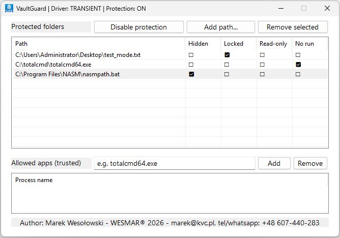
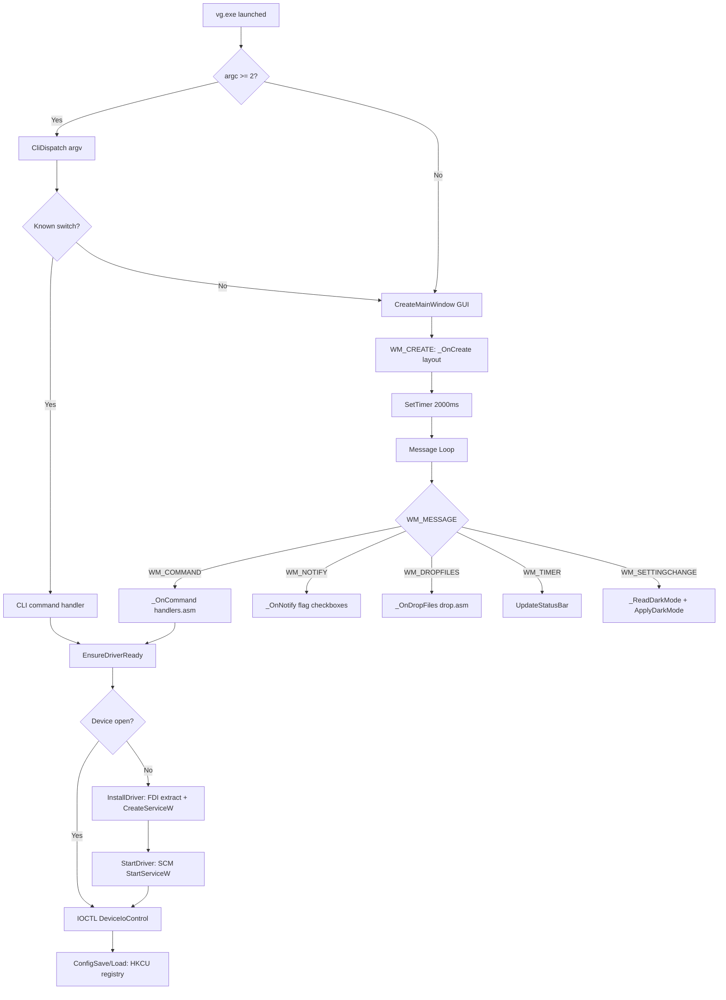

# VaultGuard

**Pure x64 MASM folder-protection for Windows — kernel minifilter, GUI + CLI, zero CRT, < 60 KB**

> Reverse-engineered IOCTL layer communicating with `vg.sys`, a kernel FSFilter Content Screener
> signed by PROMOSOFT CORPORATION (2014), which loads on Windows 11 26H1 via the legacy
> cross-signed driver compatibility mechanism.



---

## Table of Contents

- [Origin](#origin)
- [Overview](#overview)
- [Architecture](#architecture)
- [Protection Flags](#protection-flags)
- [GUI Reference](#gui-reference)
- [CLI Reference](#cli-reference)
- [Use Cases](#use-cases)
- [Driver Communication](#driver-communication)
- [Registry Layout](#registry-layout)
- [Module Analysis](#module-analysis)
- [Building from Source](#building-from-source)
- [Regression Tests](#regression-tests)
- [Known Limitations](#known-limitations)
- [Project Layout](#project-layout)
- [License](#license)

---

## Origin

This project started with a private message from **BetaTesta** on MyDigitalLife forums. He sent me the original *Secure Folders* binary — a Qt-based folder-protection suite — and asked whether I'd consider building something similar.

The binary turned out to be a real find. Inside it I found a kernel-mode FSFilter minifilter (`vg.sys`) signed in **March 2014** by **PROMOSOFT CORPORATION**. Microsoft's backward-compatibility policy loads cross-signed drivers timestamped before July 29, 2015 on Windows 10/11 without any WHQL or test-signing requirement. The driver just worked — on Windows 11 26H1, build 28000, without any patches or bypass tricks.

I reverse-engineered the IOCTL interface from the binary, extracted the driver, and rebuilt the entire userland from scratch in pure x64 MASM. During development I spent considerable time debugging driver interactions — tracing IOCTL responses, watching pool allocations, testing repeated load/unload cycles. Despite being 12 years old, `vg.sys` held up extremely well: no pool leaks, no dangling references, no stale device objects. The cleanup paths are correct. In the kernel world, that's not a given.

The result is VaultGuard — under 60 KB, zero CRT, the same binary as full Win32 GUI and fully scriptable CLI.

**Forum thread:** https://forums.mydigitallife.net/threads/vaultguard-%E2%80%94-folder-file-protection-in-pure-x64-assembly-60-kb-no-crt-win11-mica.90355/

Thanks to **BetaTesta** for the idea, the original binary, and the beta testing.

---

## Overview

Ground-up rewrite of a 12-year-old Qt/C++ folder-protection suite (~8 MB) in pure x64 MASM assembly.
The same binary runs as a full Win32 GUI application or a scriptable CLI tool.

| Property | Value |
|----------|-------|
| Binary size | < 60 KB |
| Original (Qt/C++) | ~8 MB — over 130× larger |
| CRT dependencies | Zero |
| Linked DLLs | `kernel32` `user32` `advapi32` `shell32` `ole32` `dwmapi` `gdi32` `comctl32` `uxtheme` `cabinet` |
| UI | Win32 — Dark Mode, Mica (DWM), PerMonitorV2 DPI |
| Driver | `vg.sys` — FSFilter Content Screener, Altitude 389991 |
| Service name | `clrcd` |
| Registry | `HKCU\Software\VG\Paths` · `HKCU\Software\VG\Trusted` |
| Requires | Windows 11 x64, Administrator |
| Driver signature | Signed March 18, 2014 — loads via legacy cross-sign compatibility, no test-signing needed |

---

## Quick Start

Run from an **elevated command prompt** (Administrator). Driver installs itself on first run.

**GUI — double-click `vg.exe` or run without arguments:**

- Drag a folder or file from Explorer onto the window → row appears instantly
- Drag a `.lnk` shortcut → resolved to real target automatically via `IShellLink`
- Click **Hidden / Locked / Read-only / No run** checkbox → flag applied to kernel driver immediately
- `Ctrl+Click` multiple rows → click **Remove selected** to delete them all at once
- Add a process name to **Allowed apps** → that process bypasses all driver protections
- Title bar shows live driver + protection state: `Driver: TRANSIENT | Protection: ON`

**CLI — same binary, scriptable:**

```
vg.exe /protection on
vg.exe /setitem "C:\Private" Locked
vg.exe /settrusted totalcmd64.exe Enabled
vg.exe /enumitems   out.csv
vg.exe /enumtrusted trust.csv
vg.exe /?
```

Everything above — the GUI, the CLI, the COM `.lnk` resolver, the FDI driver extractor, the SCM installer, the IOCTL layer, the registry persistence — is written in pure x64 MASM assembly. Zero CRT. Zero runtime. Every byte deliberate.

---

## Architecture



---

## Protection Flags

| Flag | CLI mode | Hex | Driver behavior |
|------|----------|-----|-----------------|
| Hidden | `Hidden` | `0x01` | Folder invisible — `STATUS_OBJECT_NAME_NOT_FOUND` + removed from dir listings |
| Locked | `Locked` | `0x02` | All access → `STATUS_ACCESS_DENIED` |
| Read-only | `Read-only` | `0x04` | Strips `FILE_WRITE_DATA` and `DELETE` from `DesiredAccess` |
| No execute | `No-execution` | `0x08` | Strips execute bits from `DesiredAccess` |
| Disabled | `Disabled` | `0x00` | Path stored in registry, inactive in driver |

Flags combine as a bitmask: `Hidden + Locked = 0x03`, `Hidden + Locked + Read-only = 0x07`, etc.

---

## GUI Reference

Launch `vg.exe` without arguments. Fixed 680 × 450 px window.

### Main Window

Class `VGMainWnd`. Driver and protection state is embedded in the window title (refreshed every 2 seconds by `WM_TIMER`):

```
VaultGuard | Driver: STOPPED   | Protection: OFF
VaultGuard | Driver: TRANSIENT | Protection: ON
```

Dark Mode and Mica backdrop follow the system theme automatically via `WM_SETTINGCHANGE`.

### Protected Folders Panel

| Control | Behavior |
|---------|----------|
| **[Add path...]** button | Opens `SHBrowseForFolderW` native folder browser |
| **[Remove selected]** button | Removes all selected entries (multi-select supported) |
| **Flag columns** (H / L / R / X) | Click any flag cell → toggles checkbox + sends IOCTL update to driver immediately |
| **Drag & Drop** | Accepts folders and files from Explorer; `.lnk` shortcuts resolved via COM `IShellLink` |

**Columns:**

| Column | Flag | Hex |
|--------|------|-----|
| Path | — | — |
| Hidden (H) | `VG_FLAG_HIDDEN` | `0x01` |
| Locked (L) | `VG_FLAG_LOCKED` | `0x02` |
| Read-only (R) | `VG_FLAG_READONLY` | `0x04` |
| No run (X) | `VG_FLAG_NOEXEC` | `0x08` |

### Trusted Processes Panel

Processes in this list bypass all driver protections — Hidden/Locked/Read-only rules do not apply to them.

| Control | Behavior |
|---------|----------|
| **Edit box** | Enter process executable name (e.g. `totalcmd64.exe`) |
| **[Add]** button | Normalizes to lowercase → `IoctlAddTrusted` + `ConfigSaveTrusted` |
| **[Remove]** button | Clears entire driver trusted list → removes registry entry → reloads remaining entries via `ConfigLoad` |

> **Note:** Removing a trusted process sends an empty `IoctlRemoveTrusted` that wipes the **entire** active trusted list in the driver. `ConfigLoad` immediately reloads all remaining registry entries. The driver provides no per-item removal IOCTL.

---

## CLI Reference

Run from an **elevated command prompt** (Administrator):

```
vg.exe /?
vg.exe /protection    on | off
vg.exe /setitem       <path>   Hidden | Locked | Read-only | No-execution | Disabled
vg.exe /settrusted    <name>   Enabled | Disabled
vg.exe /enumitems     <out.csv>
vg.exe /enumtrusted   <out.csv>
```

### Command Summary

| Command | Description | Example |
|---------|-------------|---------|
| `/?` `-h` `--help` | Print help to stdout | `vg.exe /?` |
| `/protection on\|off` | Enable or disable global protection | `vg.exe /protection on` |
| `/setitem <path> <mode>` | Set protection flags for a path | `vg.exe /setitem "C:\Data" Locked` |
| `/settrusted <name> <state>` | Add or remove a trusted process | `vg.exe /settrusted cmd.exe Enabled` |
| `/enumitems <file.csv>` | Export protected paths as UTF-16LE CSV | `vg.exe /enumitems out.csv` |
| `/enumtrusted <file.csv>` | Export trusted processes as UTF-16LE CSV | `vg.exe /enumtrusted trust.csv` |

### CSV Output Formats

`/enumitems` — UTF-16LE with BOM:
```
Path,Hidden,Locked,ReadOnly,NoExec
C:\Private,0,1,0,0
```

`/enumtrusted` — UTF-16LE with BOM:
```
Application
totalcmd64.exe
```

### Exit Codes

| Code | Meaning |
|------|---------|
| `0` | Success |
| `1` | Unknown switch / bad argument / driver error |

---

## Use Cases

### Lock a folder, allow one trusted process

```powershell
vg.exe /protection on
vg.exe /setitem "C:\Private" Locked

# Allow Total Commander through
vg.exe /settrusted totalcmd64.exe Enabled

# Verify
vg.exe /enumitems   items.csv
vg.exe /enumtrusted trust.csv

# Revoke when done
vg.exe /settrusted totalcmd64.exe Disabled
```

### Hide a folder from Explorer

```powershell
vg.exe /setitem "C:\Secret" Hidden
```

The folder disappears from Explorer, `dir`, and all directory enumeration APIs. Processes that know the full path can still address it — combine with `Locked` to block those too (use the GUI checkboxes to set multiple flags per path).

### Read-only archive

```powershell
vg.exe /setitem "C:\Backups" Read-only
```

The driver strips `FILE_WRITE_DATA` and `DELETE` bits at the kernel level. Trusted processes can still write normally.

### Scripted status check

```powershell
vg.exe /enumitems C:\temp\items.csv
$rows   = Import-Csv C:\temp\items.csv -Encoding Unicode
$locked = $rows | Where-Object { $_.Locked -eq '1' }
Write-Host "Locked paths: $($locked.Count)"
```

`Import-Csv -Encoding Unicode` reads UTF-16LE correctly on both Windows PowerShell 5.1 and PowerShell 7.

---

## Driver Communication


Reverse-engineered IOCTL codes for `vg.sys`:

| IOCTL | Code | Notes |
|-------|------|-------|
| `IOCTL_VG_ADD_PATH` | `0x9C402400` | flags=0 → Disabled; `nInBufSize` fixed at `0x6414` |
| `IOCTL_VG_ENUM_PATHS` | `0x9C402404` | |
| `IOCTL_VG_ADD_TRUSTED` | `0x9C402408` | record size `0xD94`, process name at `+4` |
| `IOCTL_VG_REMOVE_TRUSTED` | `0x9C402408` | empty input (`size=0`) clears entire list |
| `IOCTL_VG_ENUM_TRUSTED` | `0x9C40240C` | |
| `IOCTL_VG_SET_ACTIVE` | `0x9C40241C` | DWORD (4 bytes) |
| `IOCTL_VG_GET_STATUS` | `0x9C402420` | 16-byte `VG_STATUS` struct |
| `IOCTL_VG_CLEAR_ALL` | `0x9C402424` | Full reset |

Device path: `\\.\BE79F7D853E643089D51EDCDA79805C4`

`vg.sys` is embedded inside `vg.exe` as a resource — an LZX CAB appended after the first 1078 bytes of an ICO file header, extracted at install time via FDI (`cabinet.lib`, no temp files on disk during extraction).

---

## Registry Layout

```
HKEY_CURRENT_USER\Software\VG\
├── Paths\
│   "C:\Private\Data"   REG_DWORD  0x00000002  (Locked)
│   "C:\Secret"         REG_DWORD  0x00000001  (Hidden)
│   "C:\Temp\Archive"   REG_DWORD  0x00000000  (Disabled)
└── Trusted\
    "totalcmd64.exe"    REG_DWORD  0x00000001
    "explorer.exe"      REG_DWORD  0x00000001
```

`ConfigLoad` enumerates both keys and reloads the full configuration into the driver.
The driver holds no persistent state across reboots.

---

## Module Analysis

13 MASM source files, each with a single defined responsibility.

### `main.asm` — Entry Point & Globals

Entry point: `mainCRTStartup`

Startup sequence:
1. `GetStdHandle(STD_OUTPUT_HANDLE)` + `GetFileType` → `AttachConsole(-1)` if no TTY
2. `GetCommandLineW` → `CommandLineToArgvW` → `lea rdx, [rsp+20h]` as `&argc`
3. `argc >= 2` → `CliDispatch(argv[1], argv, argc)`; returns 0 (unknown) or `argc < 2` → start GUI

Public globals:

| Symbol | Type | Description |
|--------|------|-------------|
| `g_hInstance` | `dq` | Process HINSTANCE |
| `g_hwndMain` | `dq` | Main window handle |
| `g_hwndLvPaths` | `dq` | ListView "Protected Paths" |
| `g_hwndLvTrusted` | `dq` | ListView "Trusted Processes" |
| `g_hwndBtnToggle` | `dq` | Toggle button |
| `g_hDevice` | `dq` | Handle to `\\.\BE79F7D853E643089D51EDCDA79805C4` |
| `g_hFontMain`, `g_hFontSmall` | `dq` | GDI font handles |
| `g_hBrushBg` | `dq` | Background brush (`0x202020` in dark mode) |
| `g_isDarkMode` | `dd` | 1 = dark mode active |
| `g_driverInstalled`, `g_driverRunning`, `g_protActive` | `dd` | Driver state flags |
| `g_ioBuf` | `65536 B` | IOCTL enumeration buffer (64 KB) |
| `g_pathBuf`, `g_tempBuf`, `g_statusBuf` | `520 W` | Wide-character scratch buffers |

---

### `window.asm` — Window Skeleton

Contains exclusively `MainWndProc` and `CreateMainWindow`. Fixed size 680 × 450 px, class `VGMainWnd`.

| Message | Action |
|---------|--------|
| `WM_CREATE` | `_OnCreate` (layout.asm) |
| `WM_DESTROY` | `KillTimer`, `DeleteObject` (fonts + brush), `PostQuitMessage(0)` |
| `WM_CLOSE` | `DestroyWindow` |
| `WM_DROPFILES` | `_OnDropFiles` (drop.asm) |
| `WM_NOTIFY` | `_OnNotify` (handlers.asm) — flag checkboxes in the ListView |
| `WM_COMMAND` | `_OnCommand` (handlers.asm) — button clicks |
| `WM_TIMER` | `UpdateStatusBar` every 2 seconds |
| `WM_SETTINGCHANGE` | `_ReadDarkMode` + `ApplyDarkMode` + `_ApplyThemeColors` + `InvalidateRect` |
| `WM_ERASEBKGND` | `FillRect(g_hBrushBg)` — paints client area with theme background |
| `WM_CTLCOLORSTATIC` | Dark mode: `SetBkMode(OPAQUE)` + colors + returns `g_hBrushBg` |

---

### `layout.asm` — Control Creation

`_OnCreate(rcx=hwnd)` creates all widgets in a single pass:

```
[y=  8] Driver status label  +  Protection status label  +  toggle button
[y= 40] "Protected Paths" header  +  [Add path...]  +  [Remove selected]
[y= 65] ListView Paths (h=270): columns Path/H/L/R/X
         LVS_REPORT|LVS_SHOWSELALWAYS — multi-select enabled
[y=345] "Trusted Processes" header  +  [Add]  +  [Remove]
[y=365] Trusted edit box
[y=370] ListView Trusted (h=80, ~3 rows): 1 column Application
```

Key calls: `InitCommonControlsEx(ICC_LISTVIEW_CLASSES)`, `SetWindowTheme(L"DarkMode_Explorer")`, `ChangeWindowMessageFilterEx(WM_DROPFILES, MSGFLT_ALLOW)`, `DragAcceptFiles(TRUE)`, `SetTimer(TIMER_STATUS_ID, 2000)`.

---

### `theme.asm` — Dark Mode & Colors

| Procedure | Description |
|-----------|-------------|
| `_ReadDarkMode` | Reads `AppsUseLightTheme` registry value; sets `g_isDarkMode` |
| `ApplyDarkMode(rcx=hwnd)` | `DwmSetWindowAttribute(DWMWA_USE_IMMERSIVE_DARK_MODE)` + Mica via `DWMSBT_MAINWINDOW` |
| `_SetLvColors` | `SetWindowTheme("DarkMode_Explorer")` + ListView color messages |
| `_ApplyThemeColors` | Recreates `g_hBrushBg`; calls `_SetLvColors` for both ListViews |

---

### `handlers.asm` — Commands, Notify & Status

**`_OnCommand`** dispatch by control ID:

| IDC | Action |
|-----|--------|
| `IDC_BTN_TOGGLE` | `IoctlSetActive(!g_protActive)` |
| `IDC_BTN_ADD_PATH` | `SHBrowseForFolderW` → stage as `g_pendingPath` → `RefreshLists` |
| `IDC_BTN_REM_PATH` | Multi-select loop: `LVM_GETNEXTITEM(-1, LVNI_SELECTED)` → `IoctlAddPath(0)` + `ConfigRemovePath` + `LVM_DELETEITEM`; repeat until no more selected |
| `IDC_BTN_ADD_TRUSTED` | Lowercase → `IoctlAddTrusted` + `ConfigSaveTrusted` |
| `IDC_BTN_REM_TRUSTED` | `ConfigRemoveTrusted` + `IoctlRemoveTrusted(empty)` + `ConfigLoad` (reloads remaining) + `RefreshLists` |

**`_OnNotify`** — NM_CLICK on Protected Paths ListView: col 1–4 → toggle flag bit → `IoctlAddPath` + `ConfigSavePath` + `RefreshLists`.

**`UpdateStatusBar`** — `EnsureDriverReady` → `IoctlGetStatus` → updates title bar and toggle button text. Repaint suppressed when state has not changed.

**`RefreshLists`** — `IoctlEnumPaths` + `IoctlEnumTrusted` → `LVM_DELETEALLITEMS` → `_LvInsertItem` for each entry.

---

### `drop.asm` — Drag & Drop

**`_OnDropFiles(rcx=HDROP)`:**

1. `DragQueryFileW(0)` → first dropped path into `g_pathBuf`
2. Last 4 chars are `.lnk` (via `wcscmp_ci`) → call `ResolveLnkPath` → `GetLongPathNameW` (canonical case)
3. Auto-commits any prior `g_pendingPath` to registry via `ConfigSavePath(flags=0)` before overwriting
4. Stores resolved path in `g_pendingPath` → `RefreshLists` → `DragFinish`

**`ResolveLnkPath(rcx=.lnk path, rdx=out buf)`:**

`CoInitialize` → `CoCreateInstance(CLSID_ShellLink)` → `QueryInterface(IID_IPersistFile)` → `IPersistFile::Load` → `IShellLinkW::GetPath` → full COM release chain → `CoUninitialize`

---

### `driver.asm` — SCM & IOCTL Layer

| Property | Value |
|----------|-------|
| Service name | `clrcd` |
| Display name | `Vault Guard Driver` |
| Type | `SERVICE_KERNEL_DRIVER` |
| Start | `SERVICE_DEMAND_START` |
| Dependency | `FltMgr\0\0` |
| Device path | `\\.\BE79F7D853E643089D51EDCDA79805C4` |

| Procedure | Description |
|-----------|-------------|
| `OpenDevice` | `CreateFileW("\\.\BE79...", GENERIC_RW, ...)` |
| `InstallDriver` | `ExtractDriver()` → `CreateServiceW` |
| `StartDriver` | `StartServiceW` |
| `EnsureDriverReady` | `OpenDevice` → fail → `InstallDriver` → `StartDriver` → `OpenDevice` retry |

---

### `config.asm` — Registry Persistence

| Procedure | Description |
|-----------|-------------|
| `ConfigLoad` | Enumerates `Paths` → `IoctlAddPath` each; enumerates `Trusted` → `IoctlAddTrusted` each; calls `IoctlSetActive(1)` |
| `ConfigSavePath(rcx=path, rdx=flags)` | `RegCreateKeyExW` → `RegSetValueExW(path, flags)` |
| `ConfigRemovePath(rcx=path)` | `RegOpenKeyExW` → `RegDeleteValueW` |
| `ConfigSaveTrusted(rcx=name_lowercase)` | `RegCreateKeyExW` → `RegSetValueExW(name, 1)` |
| `ConfigRemoveTrusted(rcx=name)` | `RegOpenKeyExW` → `RegDeleteValueW` |

---

### `cli.asm` — Command-Line Interface

Switch comparison uses `wcscmp_ci` — fast ASCII case-insensitive wide-string compare, no `CharLowerW`. All switches work regardless of capitalization.

Every exit path goes through `_CliFinish(code)` → `ConsoleSendEnter()` (injects `VK_RETURN` via `WriteConsoleInputW`) so CMD prompt reappears immediately without waiting for Enter.

---

### `res.asm` — Driver Extraction (FDI)

The driver `vg.sys` is embedded inside `vg.exe` as a resource: an LZX CAB appended to the ICO file header.

1. `FindResourceW(NULL, IDR_DRIVER=102, RT_RCDATA=10)` → resource pointer
2. `LockResource` → raw bytes; CAB starts at offset **1078 bytes**
3. All FDI callbacks operate in memory — no temp files on disk
4. `FDICopy` → heap buffer → `WriteFile` to `%SystemRoot%\system32\drivers\vg.sys`

CAB is packed at ~42% of original size via LZX compression.

---

### `strutil.asm` — String Utilities

| Procedure | Signature | Description |
|-----------|-----------|-------------|
| `wcslen_p` | `rcx=s → rax=count` | Wide strlen |
| `wcscpy_p` | `rcx=dst, rdx=src → rax=dst` | Wide strcpy |
| `wcscat_p` | `rcx=dst, rdx=src → rax=dst` | Wide strcat |
| `wcscmp_ci` | `rcx=a, rdx=b → rax=0/nonzero` | Case-insensitive wide compare (ASCII A-Z only) |
| `wcs_ascii_lower_inplace` | `rcx=s` | Lowercases A-Z in place |
| `IntToDecW` | `rcx=val, rdx=buf → rax=ptr` | DWORD → wide decimal string |
| `IntToHexW` | `rcx=val, rdx=buf → rax=ptr` | DWORD → 8-char wide hex string |
| `WideWriteConsole` | `rcx=handle, rdx=str` | `WriteConsoleW`; falls back to ANSI `WriteFile` if handle is not a console |
| `WideWriteLn` | `rcx=str` | `WideWriteConsole(stdout, str)` + CRLF |
| `ConsoleSendEnter` | — | Injects `VK_RETURN` via `WriteConsoleInputW` |

---

### `listview.asm` — ListView Wrappers

| Procedure | Signature | Description |
|-----------|-----------|-------------|
| `_LvAddColumn` | `rcx=hwnd, rdx=idx, r8=width, r9=text` | `LVM_INSERTCOLUMNW` |
| `_LvInsertItem` | `rcx=hwnd, rdx=row, r8=col, r9=text` | `LVM_INSERTITEMW` / `LVM_SETITEMW` |
| `_LvGetItemText` | `rcx=hwnd, rdx=row, r8=col, r9=buf` | `LVM_GETITEMTEXTW` |

---

## Building from Source

Requires Visual Studio with MASM x64 toolchain (auto-detected via `vswhere.exe`):

```powershell
.\build.ps1          # full build — steps 0 through 4
.\build.ps1 -SkipRC  # skip step 0 (icon packaging) and step 1 (rc.exe)
```

Build steps:
```
[0] makecab IcoBuilder\vg.sys → LZX CAB → prepend 1078 B ICO header → ICON\vg.ico
[1] rc.exe /c65001 vg.rc → vg.res
[2] ml64.exe /c /Cp /Cx /Zi  (strutil res driver config cli theme listview handlers drop layout window main)
[3] link.exe /SUBSYSTEM:WINDOWS /NODEFAULTLIB /MANIFEST:EMBED /MANIFESTUAC:requireAdministrator
    Libs: kernel32 user32 advapi32 shell32 ole32 dwmapi gdi32 comctl32 uxtheme cabinet
[4] dumpbin — verify: no CRT imports, allowed DLL set only
```

Intermediates (`*.obj`, `*.res`, `*.pdb`) are deleted on completion.

---

## Regression Tests

`tests/cli_test.ps1` — **33 regression tests**, CLI interface only, no GUI required.  
Requires `bin\vg.exe`, loaded driver, and Administrator context.

```powershell
powershell -ExecutionPolicy Bypass -File tests\cli_test.ps1
# -KeepOutput   preserves CSV output files in tests\out\
```

| Group | Tests | What is verified |
|-------|-------|-----------------|
| Help | 1 | `/?` output on stdout |
| setitem flags | 4 | Each flag individually → registry value |
| setitem Disabled | 1 | Path in registry with value 0 |
| enumitems CSV | 3 | File content, rows, flag bits |
| settrusted + enumtrusted | 4 | Registry and CSV |
| settrusted Disabled | 2 | Entry removed; second entry unaffected |
| protection on/off | 2 | Exit code 0; bad argument → exit code 1 |
| error cases | 3 | Missing args, bad mode → exit code 1 |
| registry consistency | 13 | Remove-one-trusted: remaining entry survives |

All tests capture output via `Start-Process -RedirectStandardOutput`, which exercises the `WriteConsoleW → WriteFile ANSI fallback` path in `WideWriteConsole`.

---

## Known Limitations

| Item | Status |
|------|--------|
| `wcscmp_ci` | ASCII only (A-Z). Paths with non-ASCII characters use case-sensitive comparison — sufficient for NT paths and CLI switches |
| COM apartment | `CoInitialize`/`CoUninitialize` at every `.lnk` resolution; safe for GUI usage |
| Password mode | `/p` is parsed and silently ignored; driver has no password enforcement |
| Light mode | GUI works in light mode; ListView colors fall back to system defaults |
| Trusted list removal | No per-item IOCTL — driver only supports clearing the entire list, requiring a full reload cycle |
| Multi-file drop | Only the first dropped file/folder is processed per `WM_DROPFILES`; multi-file drops discard all but the first |

---

## Project Layout

```
VaultGuard/
├── x64/
│   ├── consts.inc      IOCTL codes, flags, struct offsets, control IDs
│   ├── globals.inc     EXTRN declarations
│   ├── main.asm        Entry point, globals, message loop
│   ├── window.asm      MainWndProc + CreateMainWindow
│   ├── layout.asm      _OnCreate — all controls
│   ├── theme.asm       Dark mode, Mica, ListView colors
│   ├── handlers.asm    _OnCommand, _OnNotify, UpdateStatusBar, RefreshLists
│   ├── drop.asm        WM_DROPFILES + ResolveLnkPath (IShellLink COM)
│   ├── listview.asm    ListView wrappers
│   ├── driver.asm      SCM + IOCTL layer + EnsureDriverReady
│   ├── config.asm      ConfigLoad/Save/Remove (registry)
│   ├── cli.asm         CliDispatch — CLI interface
│   ├── strutil.asm     String utilities + WideWriteLn/WideWriteConsole
│   ├── res.asm         ExtractDriver — FDI decompression of CAB from icon
│   ├── vg.rc           ICON 101 + RCDATA 102 (both = ICON/vg.ico)
│   └── vg.manifest     requireAdministrator, Win11 GUID, perMonitorV2
├── tests/
│   └── cli_test.ps1    33 regression tests (CLI, registry, CSV)
├── IcoBuilder/
│   ├── vg.sys          Third-party driver — PROMOSOFT CORPORATION (2014)
│   └── vg.ico          Base icon (ICO header used as CAB wrapper)
├── images/
│   └── VaultGuard.jpg  Main window screenshot
├── build.ps1           Build script — auto-detects VS + SDK via vswhere.exe
└── LICENSE.md
```

---

## License

**Source code** (`x64/*.asm`, `x64/*.inc`, `x64/vg.rc`, `x64/vg.manifest`, `build.ps1`,
`tests/`, `IcoBuilder/vg.ico`) — **MIT License**.  
See [LICENSE.md](LICENSE.md).

**`IcoBuilder/vg.sys`** — property of **PROMOSOFT CORPORATION**.  
This kernel minifilter driver binary was signed under a cross-signing certificate in 2014.
It is included here solely to enable building and running VaultGuard on supported systems.
All rights to `vg.sys` remain with PROMOSOFT CORPORATION.

---

**Author:** Marek Wesołowski (WESMAR)  
**Contact:** marek@wesolowski.eu.org  
**GitHub:** https://github.com/wesmar/VaultGuard
